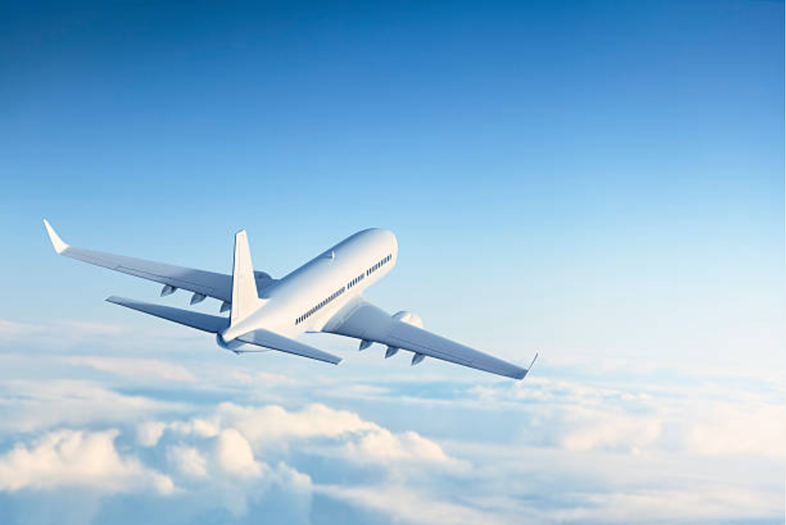
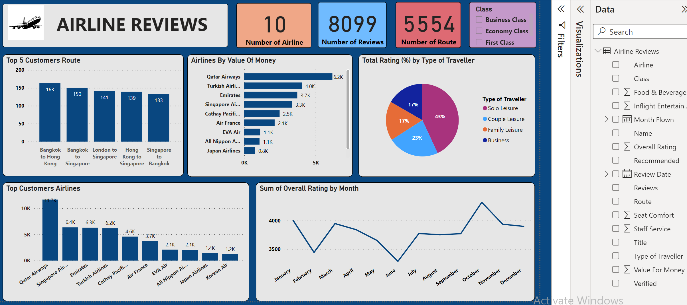
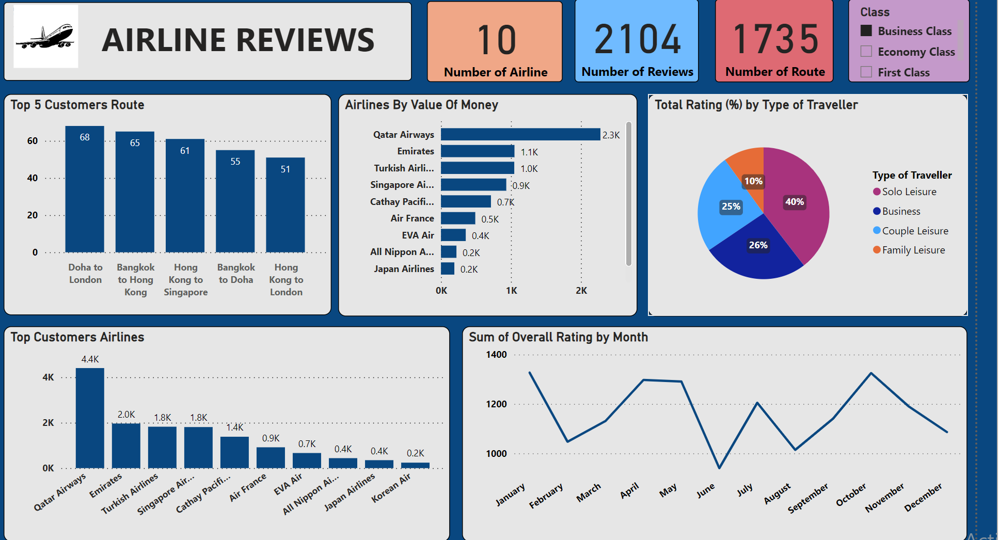
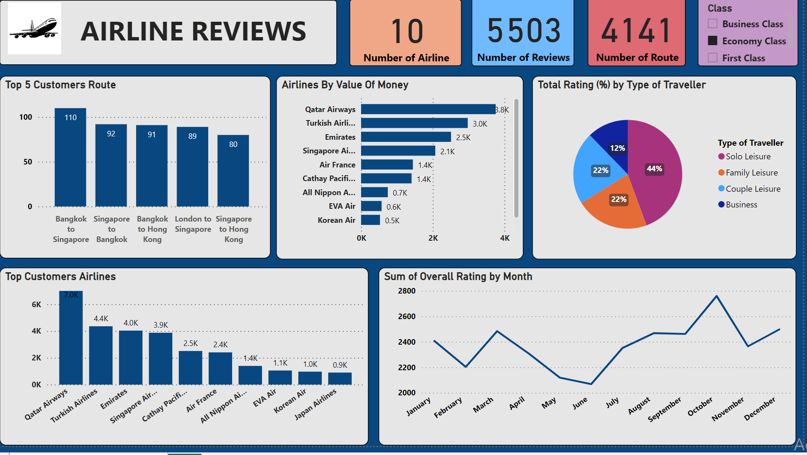
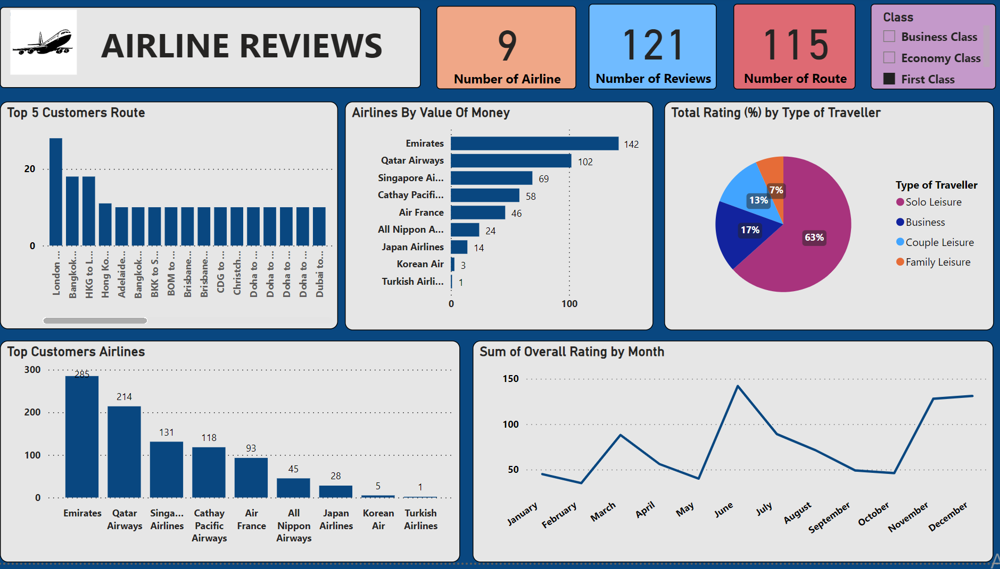

# Airline-Reviews-Analysis

## Introduction

This analysis delves into different airlines reviews dataset, which comprises a comprehensive range of feedback from passengers.
The dataset covers various aspects of airlines experience, from service quality to overall satisfaction. The primary goal is to uncover insights and trends within the dataset, with the intention of providing a visual representation of the findings. 
This visualization endeavor aims to enhance understanding of critical facets of airlines performances, potentially guiding future strategic decisions.

## Problem Statement

1. Utilize airline review dataset to extract actionable insights
2. Enhance overall customer satisfaction and service quality in the airline industry.

## Data Sourcing
 
-	The airline review dataset was efficiently cleaned and transformed with the Power Query Editor of Power BI.

- Employed data cleaning techniques such as checking for blanks, misspelled column names, and incorrect date formats.

- Implemented measures to handle misspelled values, duplicates, and irrelevant information to ensure data integrity and accuracy.
  
-	The dataset had 17 columns in number and was under a public license (free of use).

-	It was updated, reliable, current, and also consistent before I could carry on with my work.

## Visualization

The report comprises 4 pages:
1. Overall Review
2. Business Class
3. Economy Class
4. First Class

## Analysis

### Overall Review

- Qatar Airways is significant for customers value of money and Top rated airline.
- In October, the rating reaches its peak, with a total of 4323 occurrences.

### Business Class

- Qatar Airways and Emirates stand out with a significant gap of 1200 in value for money, the largest among all travelers, surpassing any other comparison in this regards.
- The month of January achieved the highest ratings for this class, surpassing by 1327.

### Economy Class

- Among the three types of travelers,the month of October ranks highest for economy class travelers, with a rating of 3760.
- Here, economy class customers have awarded the highest ratings for the airline, route, and value for money, with margins of 7,000, 110, and 3.8k respectively.

### First Class

- First class Solo Leisure travelers has the highest rate of 63% from all other Class of travelers.
- The lowest rated airline and for value or money is Turkish airline.
  

### Conclusion and Recommendation

- The rating of the economy class significantly influences the online review.
- Solo travelers have contributed greatly to the overall review, greatly increasing its depth and relevance.
- Qatar Airways is the preferred choice for most customers, while Japan Airlines and Korean Air are the least utilized options.

### Recommendation

- Enhance economy class service quality to positively influence online reviews and improve overall customer satisfaction.
- Recognize the significant impact of solo travelers on the review and prioritize their feedback to ensure its ongoing relevance and comprehensiveness.
- Qatar Airways should prioritize maintaining its high service standards, while Japan Airlines and Korean Air could benefit from strategic initiatives to boost market share, such as targeted marketing and improved customer service.

  
